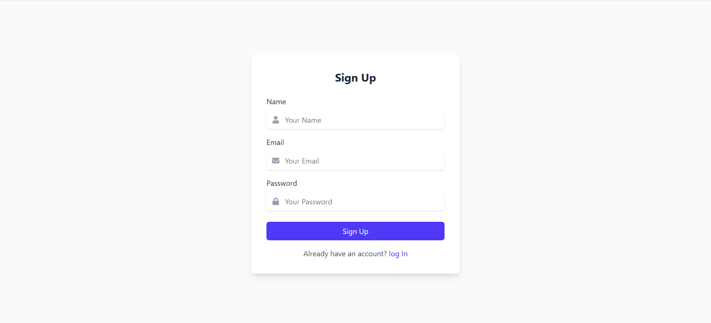

# 📚 Book Review Platform

A full-stack web application where users can register, log in, browse books, and leave reviews. Admins can add and manage books.

---

## 🚀 Features

- 👤 User authentication (register, login, JWT protected routes)
- 📖 Book listing and detail views
- ✍️ Add and read reviews per book
- 🔐 Admin-only access to add books
- 📦 Full CRUD API with MongoDB, Express, and React

---

## 🛠️ Tech Stack

### Frontend:
- React (Vite)
- Axios
- React Router DOM
- Tailwind CSS

### Backend:
- Node.js
- Express
- MongoDB + Mongoose
- JSON Web Tokens (JWT)
- bcrypt.js for password hashing
- CORS enabled

---

## 📁 Folder Structure

 # React frontend
 # Express backend

 /client # React frontend
/backend # Express backend

---

## ⚙️ Getting Started

### 1. Clone the Repo

```bash
git clone https://github.com/Shrey2031/Book-Review.git
cd book-review

#backend setup
cd backend
npm install

➕ Create a .env file
PORT=5000
MONGO_URI=your_mongo_uri
JWT_SECRET=your_jwt_secret

npm run dev


#Frontend setup
cd client
npm install
npm run dev


#API Routes Overview

Auth
POST /api/v1/users/register – Register new user

POST /api/v1/users/login – Login user


Books
GET /api/books – Get all books

GET /api/books/:id – Get single book

POST /api/books – Add book (admin only)


Reviews
GET /api/reviews?bookId=BOOK_ID

POST /api/reviews (user only)


## 📸 Screenshots

### 🔹 Home Page


### 🔹 Book Details Page


### 🔹 Review Details Page


### 🔹 sign In & sign Up Details Page




👤 Author
Name: Shreya Kumari

GitHub: Shrey2031

📄 License
This project is licensed under the MIT License.

---


